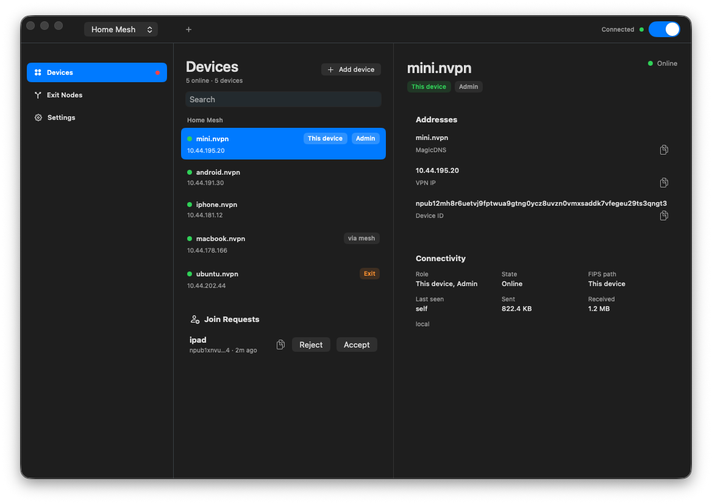

# nostr-vpn

> Main development is on [decentralized git](https://git.iris.to/#/npub1xdhnr9mrv47kkrn95k6cwecearydeh8e895990n3acntwvmgk2dsdeeycm/nostr-vpn): `htree://npub1xdhnr9mrv47kkrn95k6cwecearydeh8e895990n3acntwvmgk2dsdeeycm/nostr-vpn`

## Downloads

- [Latest release](https://github.com/mmalmi/nostr-vpn/releases/latest)

Current release artifacts:

- Apple Silicon macOS desktop app
- Headless CLI archives for Apple Silicon macOS, Windows x64, Linux x86_64, and Linux arm64

Intel macOS is source-only. The old Tauri desktop/mobile app was removed; new
native shells are being built from the shared Rust app core, starting with
macOS and then Linux.

## Overview

`nostr-vpn` is a Rust workspace for a Tailscale-style private mesh VPN built around a FIPS-backed data plane. It includes the `nvpn` CLI, a shared native app core, and native platform shells.

<p align="center">
  
</p>

It currently ships:

| Component | Purpose |
| --- | --- |
| `nvpn` | Main CLI for config, daemon lifecycle, networking, diagnostics, and tunnel sessions |
| `nvpn-reflector` | Minimal UDP reflector used for NAT discovery and hole-punch testing |
| `nostr-vpn-core` | Shared library for config, FIPS control state, NAT helpers, diagnostics, and MagicDNS |
| `nostr-vpn-app-core` | Native app state/action contract and UniFFI bridge used by the Rust-core/native-front rewrite |
| `macos` | SwiftUI/AppKit native shell over `nostr-vpn-app-core` |

## Protocol

For the current protocol-level description of invites, admin roster sync, NAT discovery, and the FIPS mesh data plane, see [docs/protocol.md](docs/protocol.md).

Private mesh traffic defaults to [FIPS](https://github.com/mmalmi/fips). `nvpn` uses the configured VPN participants as the overlay route map, but FIPS connectivity is a separate underlay: FIPS peers can be found through Nostr discovery or supplied as configured `fips_peer_endpoints`, and those FIPS peers may relay packets even when they are not members of the same VPN. `nvpn` still only admits private traffic for the active network roster.

## Platform status

| Platform | Current status |
| --- | --- |
| Apple Silicon macOS | Native SwiftUI/AppKit desktop app plus CLI tarball |
| Windows x64 | CLI zip; native shell scaffold exists but app packaging is pending |
| Android arm64 | Native shell scaffold exists; Zapstore packaging is pending |
| iOS | Native shell scaffold exists; TestFlight packaging is pending |
| Linux | CLI tarballs plus Docker e2e coverage; native GTK/libadwaita shell is next |

## What the project does today

- Generates Nostr identity keys automatically
- Stores a single app config with one or more named networks, each with participant allowlists and its own stable mesh ID
- Brings up FIPS private mesh tunnels for private network traffic
- Tracks FIPS peer/link state and NAT-discovered public endpoints
- Supports route advertisement and exit-node selection
- Exposes JSON status, network diagnostics, and doctor bundles
- Includes a native macOS GUI with service-first session control, invite QR/import flows, menu bar integration, MagicDNS controls, health reporting, and port-mapping status
- Includes Linux-focused Docker e2e coverage for FIPS mesh formation, NAT traversal, and routed UDP

## Config model

By default, `nvpn` uses the OS config directory:

- Linux: `~/.config/nvpn/config.toml`
- macOS: `~/Library/Application Support/nvpn/config.toml`
- Fallback when no config dir is available: `./nvpn.toml`

`nvpn init` creates that file if it does not exist and generates keys automatically.

The config contains:

- global app settings such as autoconnect, tray behavior, and MagicDNS suffix
- Nostr settings used by FIPS discovery, including relay URLs and identity keys
- NAT settings including STUN servers, reflectors, and discovery timeout
- node settings including endpoint, tunnel IP, listen port, and advertised routes
- a `[[networks]]` list of named participant sets with one active network at a time

Each `[[networks]]` entry carries its own `network_id`, which is the mesh identity used for roster scope and auto-derived tunnel addressing. If an older config still only has the legacy top-level default, `nostr-vpn` promotes it into per-network stable IDs and then stops recomputing them on participant changes.

Nodes that should talk to each other must share the same `network_id` and list each other as participants. Only the active network participates in the live runtime; inactive networks stay saved for later activation.

## Build and validate

Prerequisites:

- Rust stable
- OS permissions to create tunnel interfaces when running real sessions
- On Linux Docker e2e: Docker with Compose and `/dev/net/tun`

CI currently runs:

```bash
cargo fmt --check
cargo clippy --workspace --all-targets -- -D warnings
cargo test --workspace
```

Additional automation:

- `.github/workflows/windows-smoke.yml` can manually build the Windows CLI on `windows-latest`
- `.github/workflows/release.yml` publishes CLI archives and the native macOS app when signing is configured
- `scripts/local-release.mjs` builds local release artifacts and stages a hashtree-style release directory that can be published to `releases/nostr-vpn`

### Local release

Typical flow:

```bash
cp .env.release.example .env.release.local
$EDITOR .env.release.local
just release-publish
```

Notes:

- `.env.release.local` is local-only and gitignored
- the script auto-loads `.env.release.local` when present
- shell environment variables override values from those files
- on Apple Silicon macOS it can build the native macOS app/CLI locally and Windows CLI artifacts through a running Parallels VM
- Linux release artifacts are CLI tarballs until the native Linux shell lands
- Windows VM selection can be forced with `NVPN_WINDOWS_VM_NAME`; otherwise the script auto-detects a single running Windows guest
- by default it runs the same frontend build, `cargo fmt --check`, `cargo clippy`, and `cargo test` verification steps as the release workflow
- staged local release notes include the matching `CHANGELOG.md` section for the release tag, so update `CHANGELOG.md` before publishing
- omit `--publish` if you only want staged release metadata under the local temp directory

### Native macOS App

Build the native app for this machine:

```bash
just build
```

For macOS specifically, `just build` runs `just macos-build`.
After a successful build, it prints the app output path.

Launch the native macOS shell:

```bash
just run
```

If you only want the CLI and test binaries:

```bash
cargo build -p nostr-vpn-cli -p nostr-vpn-reflector
```

## Install `nvpn`

Latest releases publish CLI archives for Apple Silicon macOS, Windows x64, Linux x86_64, and Linux arm64. The quick installer below auto-detects only Apple Silicon macOS and Linux:

```bash
case "$(uname -s)/$(uname -m)" in
  Darwin/arm64) ASSET=nvpn-aarch64-apple-darwin.tar.gz ;;
  Linux/x86_64) ASSET=nvpn-x86_64-unknown-linux-musl.tar.gz ;;
  Linux/aarch64|Linux/arm64) ASSET=nvpn-aarch64-unknown-linux-musl.tar.gz ;;
  Darwin/x86_64)
    echo "No prebuilt Intel macOS release is currently published. Build from source or use an older release." >&2
    exit 1
    ;;
  *)
    echo "Unsupported platform: $(uname -s)/$(uname -m)" >&2
    exit 1
    ;;
esac
curl -fsSL "https://github.com/mmalmi/nostr-vpn/releases/latest/download/${ASSET}" | tar -xz && cd nvpn && ./install.sh
```

That command supports Apple Silicon macOS and Linux. On Intel macOS it exits with a clear message. The installer creates the target directory when needed and defaults to `/opt/homebrew/bin` on Apple Silicon macOS when that location exists or is already in `PATH`; otherwise it uses `/usr/local/bin`.

The quick-install line still points at GitHub until a verified `releases/nostr-vpn/latest` tree is published on hashtree. `htree release publish` already maintains the `latest` alias automatically; the missing step is publishing the release tree and verifying the public `upload.iris.to/<npub>/releases/nostr-vpn/latest/...` paths.

On Windows, download the `nvpn-<version>-x86_64-pc-windows-msvc.zip` release asset and run `nvpn.exe`, or build from source.

From source:

```bash
cargo install --path crates/nostr-vpn-cli --bin nvpn
```

This is the supported route on Intel macOS.

If you already have a release tarball, extract it and run:

```bash
./install.sh
```

You can also pass a custom destination directory, for example `./install.sh ~/.local/bin`.

## CLI quickstart

Create or refresh config and generate keys:

```bash
nvpn init \
  --participant npub1...alice \
  --participant npub1...bob
```

Adjust persisted settings if needed:

```bash
nvpn set \
  --endpoint 192.0.2.10:51820 \
  --listen-port 51820 \
  --fips-advertise-endpoint true \
  --fips-peer-endpoint npub1...bob=192.0.2.11:51820 \
  --tunnel-ip 10.44.0.10/32
```

Run a full foreground session:

```bash
nvpn connect
```

Shorter lifecycle commands:

```bash
nvpn up
nvpn down
```

Daemonized flow used by native desktop apps:

```bash
nvpn start --daemon --connect
nvpn pause
nvpn resume
nvpn stop
```

For persistent privileged startup:

```bash
sudo nvpn service install
nvpn service status
```

On Windows, run `nvpn service install` from an elevated shell instead of using `sudo`.

The service implementation targets:

- macOS via `launchd`
- Linux via `systemd`
- Windows via the Service Control Manager (`sc.exe`)

`nvpn service enable` / `nvpn service disable` are currently implemented only on macOS. On Linux and Windows, `install` / `uninstall` handle the persistent service lifecycle directly.

Inspect runtime state:

```bash
nvpn status --json
nvpn netcheck --json
nvpn doctor --json
```

Write a support bundle:

```bash
nvpn doctor --write-bundle /tmp/nvpn-doctor
```

Advertise routes or use an exit node:

```bash
nvpn set --advertise-routes 10.0.0.0/24,192.168.0.0/24
nvpn set --advertise-exit-node true
nvpn set --exit-node npub1...peer
```

Clear exit-node selection:

```bash
nvpn set --exit-node off
```

Lower-level commands:

- `init`
- `service`
- `connect`
- `status`
- `set`
- `create-invite`
- `import-invite`
- `add-participant`
- `remove-participant`
- `add-admin`
- `remove-admin`
- `nat-discover`
- `hole-punch`
- `ping`
- `ip`
- `whois`
- `doctor`

## Native Apps

Native app work is split into a Rust-owned state/action core and platform shells.

The native UI rewrite parity target is tracked in [`docs/native-ui-parity-matrix.md`](docs/native-ui-parity-matrix.md).
The shared native app contract lives in [`crates/nostr-vpn-app-core`](crates/nostr-vpn-app-core), with native shell targets under [`macos`](macos), [`windows`](windows), [`linux`](linux), [`android`](android), and [`ios`](ios).
The local native shell can be built with `just build` and launched with `just run`.
Use `just run-macos` or `just run-linux` when you want a specific desktop target.

Notes:

- desktop shells use the installed/bundled `nvpn` binary for privileged service/session work
- mobile shells will own their platform VPN runtime bridges while sharing the same Rust app contract
- the legacy Tauri/Svelte app was removed after the native rewrite became the canonical architecture

## Local NAT test binary

For local integration testing:

Run a UDP reflector:

```bash
cargo run -p nostr-vpn-reflector --bin nvpn-reflector -- --bind 127.0.0.1:3478
```

The reflector is used by `nvpn nat-discover` and `nvpn hole-punch` in local and Docker e2e setups.

## Docker end-to-end coverage

Docker e2e scripts under [`scripts/`](scripts):

- `./scripts/e2e-docker.sh`
  Verifies static FIPS peer configuration, mesh formation, and tunnel ping.
- `./scripts/e2e-connect-docker.sh`
  Verifies config-driven `nvpn connect`, FIPS mesh formation, and tunnel ping.
- `./scripts/e2e-active-network-docker.sh`
  Verifies that inactive saved networks do not change the active mesh identity, expected peer count, or auto-derived tunnel IP.
- `./scripts/e2e-divergent-roster-docker.sh`
  Verifies that peers with a shared mesh ID can still connect when one node has extra configured participants.
- `./scripts/e2e-nat-docker.sh`
  Verifies daemon mode across separate Docker NATs, public endpoint discovery, handshake success, and ping.
- `./scripts/e2e-exit-node-docker.sh`
  Verifies exit-node advertisement, selection, tunnel traffic to the chosen exit node, and default-route traffic crossing the exit path to an external target. Set `NVPN_EXIT_NODE_E2E_PUBLIC_IP=9.9.9.9` (or another reachable public IP) to also prove a real internet hop routes through the tunnel.
These flows are Linux-oriented because they require real tunnel devices and container networking privileges.

## Desktop update end-to-end coverage

Desktop updater scripts under [`scripts/`](scripts):

- `./scripts/e2e-update-desktop.sh`
  Runs the macOS app updater path, Linux GTK updater path in Docker, and Windows WPF updater path in a Parallels VM.
- `./scripts/e2e-update-macos.sh`
  Builds the macOS app, checks a local release manifest, downloads a fake `.app.tar.gz`, and verifies the app bundle can be unpacked.
- `./scripts/e2e-update-linux.sh`
  Runs the Linux app in the Docker dev image, checks a local release manifest, downloads the selected AppImage, and verifies it is executable.
- `./scripts/e2e-update-windows-vm.sh`
  Runs `scripts/e2e-update-windows.ps1` inside the Windows VM, builds the WPF app, checks a local release manifest, and verifies the selected setup executable downloads.
- `./tools/run-windows`
  On macOS, builds and runs the Windows app inside the running Parallels Windows VM. The macOS host is not expected to have PowerShell or .NET installed.

The update E2E scripts set `NVPN_UPDATE_MANIFEST_URL` to a local fixture and suppress opening installers/packages, so they test update selection and download/install preparation without touching production release storage.

## Workspace layout

- [`Cargo.toml`](Cargo.toml): workspace definition
- [`crates/nostr-vpn-core`](crates/nostr-vpn-core): shared config, FIPS control state, diagnostics, MagicDNS, and NAT helpers
- [`crates/nostr-vpn-cli`](crates/nostr-vpn-cli): `nvpn` CLI and daemon implementation
- [`crates/nostr-vpn-app-core`](crates/nostr-vpn-app-core): native app state/action contract and UniFFI bridge
- [`macos`](macos), [`linux`](linux), [`windows`](windows), [`android`](android), [`ios`](ios): native platform shells
- [`crates/nostr-vpn-reflector`](crates/nostr-vpn-reflector): NAT discovery and hole-punch reflector binary
- [`scripts`](scripts): build, release, Docker e2e, and desktop updater e2e entrypoints

## Release workflow notes

Release workflow ([`.github/workflows/release.yml`](.github/workflows/release.yml)):

- runs on pushed `v*` tags or manual dispatch
- verifies formatting, clippy, and tests before publishing artifacts
- publishes CLI archives for Apple Silicon macOS, Windows x64, Linux x86_64, and Linux arm64
- publishes Apple Silicon macOS as a native `Nostr VPN.app` archive when signing is configured
- requires the macOS signing and notarization secrets to be configured before a release can publish the macOS app
- generates its GitHub release notes in the workflow; local `scripts/local-release.mjs` release notes include the matching `CHANGELOG.md` section for the tag
